# DevOverflow Complete Architecture - Single Diagram

Copy the Mermaid code below and paste it into any Mermaid visualizer (like mermaid.live, GitHub, or VS Code with Mermaid extension).

```mermaid
graph TB
    %% Styling
    classDef pageClass fill:#e1f5ff,stroke:#01579b,stroke-width:2px,color:#000000
    classDef componentClass fill:#f3e5f5,stroke:#4a148c,stroke-width:2px,color:#000000
    classDef apiClass fill:#fff3e0,stroke:#e65100,stroke-width:2px,color:#000000
    classDef modelClass fill:#e8f5e9,stroke:#1b5e20,stroke-width:2px,color:#000000
    classDef utilClass fill:#fff9c4,stroke:#f57f17,stroke-width:2px,color:#000000
    classDef contextClass fill:#fce4ec,stroke:#880e4f,stroke-width:2px,color:#000000
    classDef dbClass fill:#e0f2f1,stroke:#004d40,stroke-width:3px,color:#000000
    
    %% Database Layer
    MongoDB[(MongoDB Database)]:::dbClass
    
    %% Models Layer
    UserModel[User Model<br/>name, email, username<br/>bio, reputation]:::modelClass
    AccountModel[Account Model<br/>user, provider<br/>providerId, authMethod]:::modelClass
    QuestionModel[Question Model<br/>title, content, tags<br/>votes, views, answers]:::modelClass
    AnswerModel[Answer Model<br/>author, question<br/>content, votes]:::modelClass
    TagModel[Tag Model<br/>name, questions count]:::modelClass
    VoteModel[Vote Model<br/>author, actionId<br/>actionType, voteType]:::modelClass
    CollectionModel[Collection Model<br/>author, question]:::modelClass
    InteractionModel[Interaction Model<br/>user, action<br/>actionId, actionType]:::modelClass
    
    %% API Routes Layer
    AuthAPI[Auth API<br/>/api/auth/nextauth<br/>NextAuth Handlers]:::apiClass
    UserAPI[User API<br/>GET/POST/PUT/DELETE<br/>/api/users]:::apiClass
    AccountAPI[Account API<br/>GET/POST<br/>/api/accounts]:::apiClass
    
    %% Utilities & Validation Layer
    ZodSchemas[Zod Schemas<br/>SignIn, SignUp<br/>Question, User<br/>Account, Vote]:::utilClass
    ErrorHandler[Error Handler<br/>ValidationError<br/>NotFoundError<br/>ForbiddenError]:::utilClass
    DBConnect[DB Connection<br/>Mongoose Cache<br/>Connection Pool]:::utilClass
    Utils[Utilities<br/>cn, getTimeStamp<br/>getDeviconClassName]:::utilClass
    Logger[Pino Logger<br/>Structured Logging]:::utilClass
    
    %% Context Providers
    SessionProvider[SessionProvider<br/>NextAuth Session]:::contextClass
    ThemeProvider[ThemeProvider<br/>next-themes<br/>Light/Dark/System]:::contextClass
    
    %% Root Layout
    RootLayout[Root Layout<br/>app/layout.tsx<br/>SessionProvider<br/>ThemeProvider<br/>Toaster]:::pageClass
    
    %% Main Layout
    MainLayout[Main Layout<br/>app/root/layout.tsx]:::pageClass
    
    %% Navigation Components
    Navbar[Navbar<br/>Logo, Search<br/>Theme, Mobile Nav]:::componentClass
    LeftSideBar[LeftSideBar<br/>NavLinks<br/>Sign In/Up Buttons]:::componentClass
    RightSideBar[RightSideBar<br/>Top Questions<br/>Popular Tags]:::componentClass
    
    %% Pages
    HomePage[Home Page<br/>Question Feed<br/>Search & Filters]:::pageClass
    AskQuestionPage[Ask Question Page<br/>Question Form]:::pageClass
    ProfilePage[Profile Page<br/>User Info & Activity]:::pageClass
    SignInPage[Sign In Page<br/>Auth Form]:::pageClass
    SignUpPage[Sign Up Page<br/>Auth Form]:::pageClass
    CommunityPage[Community Page]:::pageClass
    TagsPage[Tags Page]:::pageClass
    CollectionPage[Collection Page]:::pageClass
    JobsPage[Jobs Page]:::pageClass
    
    %% UI Components
    QuestionCard[QuestionCard<br/>Title, Tags<br/>Metrics, Author]:::componentClass
    TagCard[TagCard<br/>Tag Name<br/>Devicon, Count]:::componentClass
    Metric[Metric Component<br/>Icon, Value, Title]:::componentClass
    LocalSearch[LocalSearch<br/>Search Input]:::componentClass
    HomeFilter[HomeFilter<br/>Filter Options]:::componentClass
    
    %% Form Components
    QuestionForm[QuestionForm<br/>React Hook Form<br/>MDXEditor<br/>Tag Input]:::componentClass
    AuthForm[AuthForm<br/>React Hook Form<br/>Email/Password]:::componentClass
    SocialAuthForm[SocialAuthForm<br/>GitHub/Google OAuth]:::componentClass
    
    %% Connections - Database to Models
    MongoDB --> UserModel
    MongoDB --> AccountModel
    MongoDB --> QuestionModel
    MongoDB --> AnswerModel
    MongoDB --> TagModel
    MongoDB --> VoteModel
    MongoDB --> CollectionModel
    MongoDB --> InteractionModel
    
    %% Connections - Models to APIs
    UserModel --> UserAPI
    AccountModel --> AccountAPI
    UserModel --> AuthAPI
    AccountModel --> AuthAPI
    
    %% Connections - APIs to Utilities
    UserAPI --> ZodSchemas
    AccountAPI --> ZodSchemas
    AuthAPI --> ZodSchemas
    UserAPI --> ErrorHandler
    AccountAPI --> ErrorHandler
    AuthAPI --> ErrorHandler
    UserAPI --> DBConnect
    AccountAPI --> DBConnect
    AuthAPI --> DBConnect
    ErrorHandler --> Logger
    DBConnect --> MongoDB
    
    %% Connections - Root to Main Layout
    RootLayout --> SessionProvider
    RootLayout --> ThemeProvider
    RootLayout --> MainLayout
    
    %% Connections - Main Layout to Navigation
    MainLayout --> Navbar
    MainLayout --> LeftSideBar
    MainLayout --> RightSideBar
    
    %% Connections - Main Layout to Pages
    MainLayout --> HomePage
    MainLayout --> AskQuestionPage
    MainLayout --> ProfilePage
    MainLayout --> CommunityPage
    MainLayout --> TagsPage
    MainLayout --> CollectionPage
    MainLayout --> JobsPage
    
    %% Connections - Auth Pages
    RootLayout --> SignInPage
    RootLayout --> SignUpPage
    
    %% Connections - Pages to Components
    HomePage --> LocalSearch
    HomePage --> HomeFilter
    HomePage --> QuestionCard
    AskQuestionPage --> QuestionForm
    SignInPage --> AuthForm
    SignInPage --> SocialAuthForm
    SignUpPage --> AuthForm
    SignUpPage --> SocialAuthForm
    
    %% Connections - Component Dependencies
    QuestionCard --> TagCard
    QuestionCard --> Metric
    QuestionCard --> Utils
    RightSideBar --> TagCard
    TagCard --> Utils
    Navbar --> ThemeProvider
    LeftSideBar --> SessionProvider
    
    %% Connections - Forms to Validation
    QuestionForm --> ZodSchemas
    AuthForm --> ZodSchemas
    
    %% Connections - Forms to APIs
    QuestionForm -.->|POST| UserAPI
    AuthForm -.->|POST| AuthAPI
    SocialAuthForm -.->|OAuth| AuthAPI
    
    %% Connections - Components to APIs
    HomePage -.->|GET| UserAPI
    ProfilePage -.->|GET| UserAPI
    QuestionCard -.->|GET/POST| UserAPI
    
    %% Model Relationships
    UserModel -.->|1:N| AccountModel
    UserModel -.->|1:N| QuestionModel
    UserModel -.->|1:N| AnswerModel
    UserModel -.->|1:N| VoteModel
    UserModel -.->|1:N| CollectionModel
    UserModel -.->|1:N| InteractionModel
    QuestionModel -.->|1:N| AnswerModel
    QuestionModel -.->|N:M| TagModel
    QuestionModel -.->|1:N| VoteModel
    QuestionModel -.->|1:N| CollectionModel
    AnswerModel -.->|1:N| VoteModel
    
    %% Legend
    subgraph Legend
        L1[Pages]:::pageClass
        L2[Components]:::componentClass
        L3[API Routes]:::apiClass
        L4[Models]:::modelClass
        L5[Utilities]:::utilClass
        L6[Context]:::contextClass
        L7[Database]:::dbClass
    end
```

## How to Use

1. **Copy the entire Mermaid code block** (everything between the triple backticks with `mermaid`)
2. **Paste it into a visualizer:**
   - [mermaid.live](https://mermaid.live) - Best for interactive viewing
   - GitHub markdown preview
   - VS Code with Mermaid extension
   - Notion, Obsidian, or any Mermaid-compatible tool

## Diagram Legend

- **Blue boxes** = Pages/Routes
- **Purple boxes** = UI Components
- **Orange boxes** = API Routes
- **Green boxes** = Database Models
- **Yellow boxes** = Utilities/Validation
- **Pink boxes** = Context Providers
- **Teal cylinder** = MongoDB Database
- **Solid arrows** = Direct dependencies
- **Dotted arrows** = API calls or relationships

## Key Insights from the Diagram

1. **Three-tier architecture**: Pages → APIs → Models → Database
2. **Shared utilities**: All layers use Zod validation and error handling
3. **Context providers**: Session and Theme wrap the entire app
4. **Component reusability**: TagCard, Metric used across multiple pages
5. **Model relationships**: User is central, connected to all other models
6. **Form validation**: Client-side (React Hook Form) + Server-side (Zod)
7. **Authentication flow**: OAuth through NextAuth → Account → User
8. **Navigation structure**: Navbar + LeftSideBar + RightSideBar in main layout
